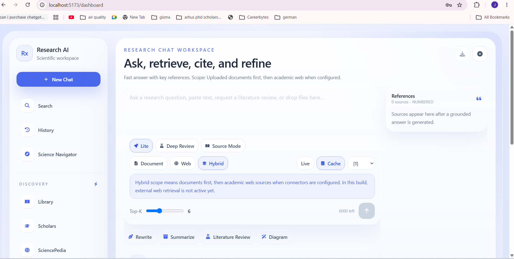
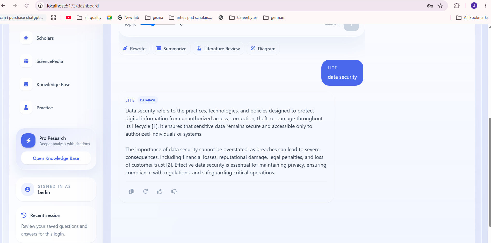

# 🚀 Research AI Platform

<p align="center">
  
  
  
  
  
  
</p>

<p align="center">
  <strong>
    AI-Powered Research Workspace for Intelligent Document Analysis, Semantic Search,
    and Retrieval-Augmented Generation (RAG)
  </strong>
</p>

---

## 📚 Overview

Research AI Platform is a full-stack AI-powered research assistant that enables users to upload documents, build a personal knowledge base, perform semantic search, and interact with their documents using Retrieval-Augmented Generation (RAG).

The platform combines document intelligence, conversational AI, semantic retrieval, and local Large Language Models (LLMs) into a unified research environment.

Unlike traditional chatbots, responses are grounded in user-provided documents, ensuring greater relevance, transparency, and explainability.

---
---

## 📸 Application Preview

<p align="center">
  
  
  
</p>
---

## 🎯 Key Features

### 🤖 AI-Powered Research Assistant

- Retrieval-Augmented Generation (RAG)
- Context-aware question answering
- Source-grounded responses
- Multi-document reasoning
- Follow-up conversation support

### 📄 Document Intelligence

- Upload research documents
- Automatic document processing
- Text extraction and indexing
- Research library management
- Metadata organization

### 🔍 Semantic Search

- Intelligent document retrieval
- Contextual search capabilities
- Relevance-based ranking
- Source attribution
- Fast query execution

### 💬 Conversational Research

- Interactive AI chat interface
- Multi-turn conversations
- Research-focused workflows
- Citation-based answers
- Document-aware responses

### ⚡ Performance Optimization

- Intelligent caching layer
- Optimized retrieval pipeline
- Faster response generation
- Reduced LLM inference overhead

### 🔐 Secure Workspace

- User authentication
- Protected research libraries
- User-specific document ownership
- Secure API endpoints

---

## 🏗️ System Architecture

```text
┌─────────────────────────────┐
│       React Frontend        │
└──────────────┬──────────────┘
               │
               ▼
┌─────────────────────────────┐
│        FastAPI API          │
└──────────────┬──────────────┘
               │
     ┌─────────┼─────────┐
     │         │         │
     ▼         ▼         ▼
 SQLite     Cache      RAG
Database    Layer     Engine
     │                   │
     ▼                   ▼
Document          Ollama LLM
Storage           Inference
```

---

## 🚀 Core Research Workflow

```text
Upload Documents
       │
       ▼
Document Processing
       │
       ▼
Indexing & Storage
       │
       ▼
Semantic Retrieval
       │
       ▼
Context Selection
       │
       ▼
LLM Generation
       │
       ▼
Grounded Response
```

---

## 🛠️ Technology Stack

### Frontend

- React
- Vite
- JavaScript
- CSS
- Axios

### Backend

- FastAPI
- Python
- SQLAlchemy
- SQLite
- Pydantic

### Artificial Intelligence

- Retrieval-Augmented Generation (RAG)
- Ollama
- Large Language Models (LLMs)
- Semantic Retrieval
- Prompt Engineering

### Infrastructure

- Git
- GitHub
- REST APIs

---

## 📦 Project Structure

```text
research-ai-platform/
│
├── backend/
│   ├── app/
│   │   ├── routes/
│   │   ├── services/
│   │   ├── models/
│   │   ├── database/
│   │   └── core/
│   │
│   ├── uploads/
│   └── requirements.txt
│
├── frontend-react/
│   ├── src/
│   │   ├── features/
│   │   ├── components/
│   │   ├── services/
│   │   └── pages/
│   │
│   └── package.json
│
├── docs/
│
└── README.md
```

---

## 🔥 Research Modes

### ⚡ Lite Mode

Quick answers for everyday research questions.

### 📚 Deep Review Mode

Comprehensive analysis and synthesis of retrieved information.

### 📖 Source Mode

Evidence-grounded responses with source references.

---

## 🚀 Getting Started

### Prerequisites

Before running the application, ensure you have:

- Python 3.10+
- Node.js 18+
- Git
- Ollama installed locally

---

### Install Local LLM

Pull the model used by the backend:

```bash
ollama pull llama3.2
```

---

### Start Ollama

```bash
ollama serve
```

---

## Backend Setup

Navigate to backend directory:

```bash
cd backend
```

Create virtual environment:

```bash
python -m venv venv
```

Activate environment:

### Windows

```bash
venv\Scripts\activate
```

### Linux / Mac

```bash
source venv/bin/activate
```

Install dependencies:

```bash
pip install -r requirements.txt
```

Run backend:

```bash
uvicorn app.main:app --reload
```

Backend URL:

```text
http://localhost:8000
```

---

## Frontend Setup

Navigate to frontend:

```bash
cd frontend-react
```

Install dependencies:

```bash
npm install
```

Run frontend:

```bash
npm run dev
```

Frontend URL:

```text
http://localhost:5173
```

---

## 🔑 Major Components

### Research Library

- Document management
- File organization
- Knowledge base creation

### Search Engine

- Semantic search
- Context retrieval
- Source ranking

### RAG Pipeline

- Query understanding
- Context retrieval
- Prompt construction
- LLM response generation

### Chat Interface

- Interactive research assistant
- Context retention
- Multi-turn conversations

### Authentication System

- User login
- Secure access control
- Protected resources

---

## 💡 Technical Highlights

### AI Engineering

- Retrieval-Augmented Generation (RAG)
- Context-aware prompting
- Grounded AI responses
- Semantic document retrieval

### Backend Engineering

- Modular FastAPI architecture
- RESTful API design
- Service-layer abstraction
- Secure endpoint management

### Frontend Engineering

- Component-based React architecture
- Responsive user interface
- API-driven communication
- State management

### Performance Engineering

- Intelligent caching
- Reduced retrieval latency
- Optimized search pipeline
- Faster response generation

---

## 🎓 Skills Demonstrated

This project showcases expertise in:

- Artificial Intelligence
- Large Language Models (LLMs)
- Retrieval-Augmented Generation (RAG)
- Semantic Search Systems
- FastAPI Development
- React Development
- Full-Stack Engineering
- REST API Design
- Database Design
- Software Architecture
- Performance Optimization
- Prompt Engineering

---

## 🔮 Future Enhancements

- Vector Database Integration
- Research Report Generation
- PDF Summarization
- Knowledge Graph Visualization
- Multi-Agent Research Workflows
- Citation Exporting
- Research Collaboration Features
- Cloud Deployment
- Docker Support
- Kubernetes Deployment

---

## 📈 Why This Project Matters

Researchers and professionals spend significant time searching through documents, papers, and reports.

Research AI Platform transforms that workflow by enabling:

- Faster information discovery
- Context-aware research assistance
- Semantic document understanding
- Evidence-based AI responses

The result is a more efficient, explainable, and intelligent research experience.

---

## 👨‍💻 Author

### Josmy Mathew

AI Engineer | Data Scientist | Machine Learning Enthusiast

- MSc Data Science, AI & Digital Business (Germany)
- 12+ Years Teaching Experience
- Full-Stack AI Application Development
- Retrieval-Augmented Generation (RAG)
- Machine Learning & NLP

---

## ⭐ Support

If you find this project useful, consider giving it a star.

It helps others discover the project and supports future development.

---

<p align="center">
  Built with ❤️ using FastAPI, React, Ollama, and Retrieval-Augmented Generation (RAG)
</p>